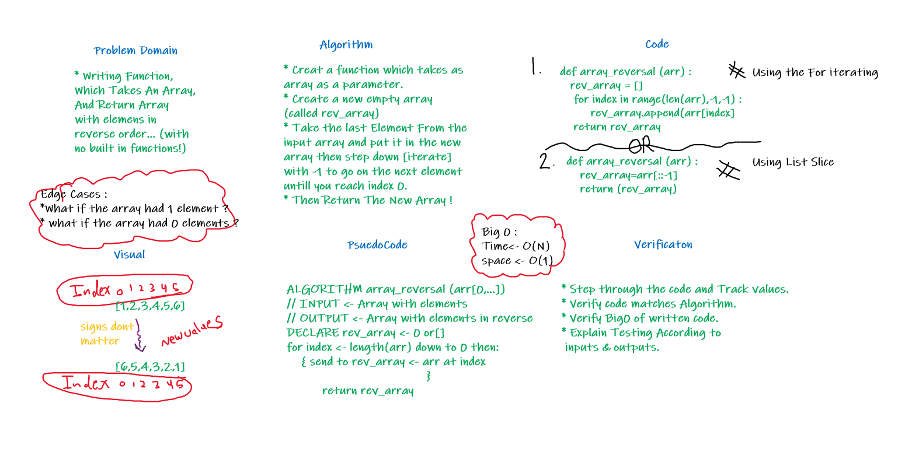

# Reverse an Array

> [Back to Home](../README.md)

## Question is

>Write a function called reverseArray which takes an array as an argument. Without utilizing any of the built-in methods available to your language, return an array with elements in reversed order.

## **Whiteboard Process**

> [Back to Home](../README.md)
