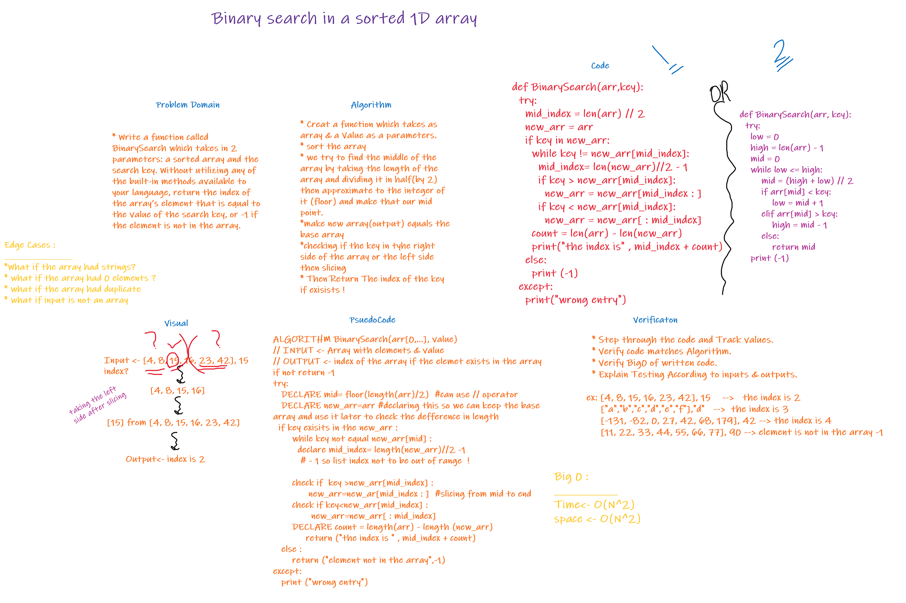

# Binary search in a sorted 1D array

> [Back to Home](../README.md)

## Question is

> Write a function called BinarySearch which takes in 2 parameters: a sorted array and the search key. Without utilizing any of the built-in methods available to your language, return the index of the array’s element that is equal to the value of the search key, or -1 if the element is not in the array.

## **Whiteboard Process**

## Approach & Efficiency

- Create method that take an array and integer as parameter
  -Initilize 2 values and declare it:

      mid_index = len (arr) // 2

      new_arr=arr

- Now we want to search for the element we need using binary search So we need to convert the array to two parts and check if the element is the middle element so the index we return is the index for the middle element, or IF it is less than the middle so continue searching on the right Half or the Left Half.

-Return the index of key if found, if not found return -1

> [Back to Home](../README.md)
