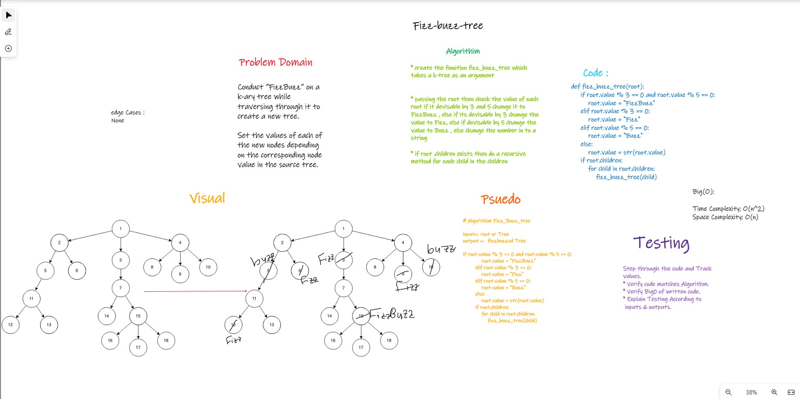

# Fizz Buzz Tree

## Challenge 18

### Structure and Testing

Utilize the Single-responsibility principle: any methods you write should be clean, reusable, abstract component parts to the whole challenge.

and written Tests.

## whiteboarding

## Approach & Efficiency

    * create the function fizz_buzz_tree which takes a k-tree as an argument

    - passing the root then check the value of each root if it devisable by 3 and 5 change it to FizzBuzz , else if its devisable by 3 change the value to Fizz, else if devisable by 5 change the value to Buzz , else change the number in to a string

    - if root .children exists then do a recursive method for each child in the children

      > Time Complexity: O(n^2)
      > Space Complexity: O(n)

## API

---
