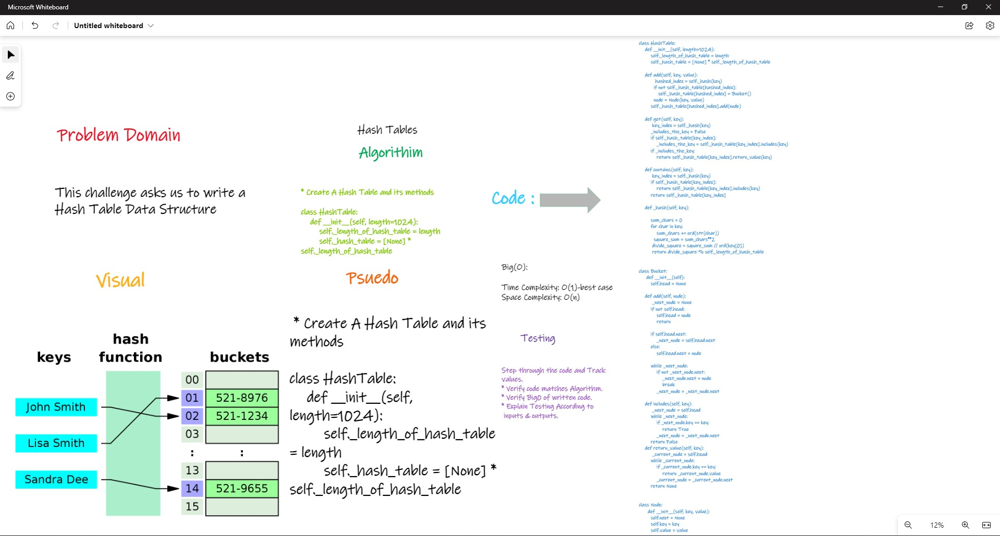

# HashTables

## Structure and Testing

Utilize the Single-responsibility principle: any methods you write should be clean, reusable, abstract component parts to the whole challenge.

and written Tests.

## whiteboarding



## Approach & Efficiency

An array was the chosen data structure to use for the HashTable and a linked list was the chosen data structure for to use at each index of the Hash Table to handle collisions.

Adding key/value pairs and getting values from the Hash Table is essentially O(1) for time for both posting and getting. Big O is always looking for the worst case scenario. The worst case would be the length of the linked list at any given index. Say one index had 5 colisions, the Big O for time would be O(5) in that case for time.

## API

Three public methods for this Hash Table.

```
1. HashTable.add(key, value)
2. HashTable.get(key)
3. HashTable.contains(key)
```

Add: Takes key and value as arguements, hashes the key, returns hash-index, and adds the key/value pair to the HashTable at hash-index. Also handles collisions.

Get: Takes key as arguement, hashes key; assigns a hash-index, returns value from table at the hash-index.

## Contains: Takes in a key as arguement and returns a boolean if key is already in HashTable
