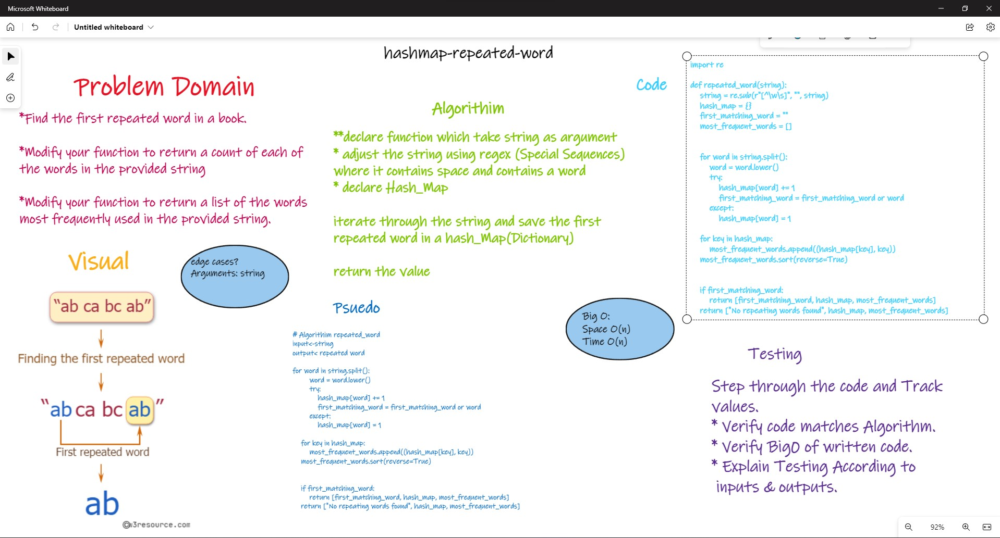

# hashmap-repeated-word

## Challenge 31

### Structure and Testing

Utilize the Single-responsibility principle: any methods you write should be clean, reusable, abstract component parts to the whole challenge.

and written Tests.

## whiteboarding



## Approach & Efficiency

```md
- iterate through the string input and check if the word exists in the hashmap after save the word and the count in the hashmap using regex approach

  > Time Complexity: O(n)
  > Space Complexity: O(n)
```

## API

## pull requests

[pr `26` - Repeated_Word](https://github.com/Ammaro173/data-structures-and-algorithms/pull/26)
