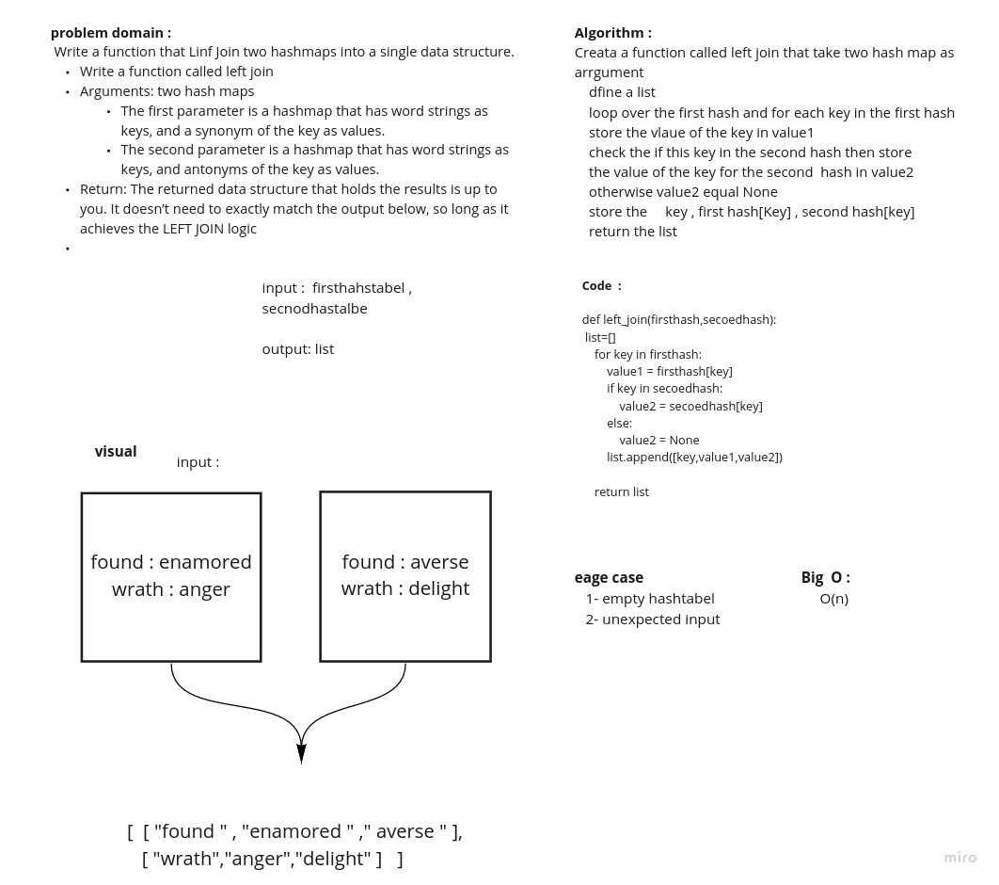

# Data-Structures-and-Algorithms Quick Sort

> [Back to Home](../README.md)

## Problem domain

Implement a simplified LEFT JOIN for 2 Hashmaps.
This challenge asks us to write a function that takes two hash tables as arguements and returns a list of the joined key/values. If there is no match in the second hash table for a given key, the list will include None for as the value joined from the 2nd hash table.

## **Whiteboard Process**



## Approach & Efficiency

```md
Iterate through the entire 1st hash table (the left table) and when an element is found, check if that element's key exists in the second hash table. If it does, append (key, value_1, value_2) if it does not append (key, value_1, None).

We need to join all of the values from hash table 2 with the values from hash table 1 at all the keys (columns) in hash table one. Because our function is not aware of any of the keys in either hash table, the approach here is to iterate through the entire length of hash table 1 and find all of the elements. As we iterate index by index if the index contains an element (is not None/null) then we need to check hash table 2.

We check hash table 2 using the key from the found element in hash table 1. We want to see if ht2 contains an element with that same key. If it does, we append (key, value_1, value_2) to a list localy defined in the function. In the case that ht2 does not contain an element with the same key, we append (key, value_1, None) to our local list.

We also have to account for collisions when ht1 was mapped. We write a while loop (while there is an element - in this module, a node) and do the same checks from the paragraph prior. After the checks we change the current_node = current_node.next. In every case we will eventually reach a point where our element has a node that points to None and the while loop will break.

So we iterate for the entire length of ht1. Once we have reached the end we know a few things. We know that we have searched every element (keys/values) from ht1. We also have tested all of the keys from ht1 against ht2. And if that key existed in ht2, we "joined" its value. It is worth noting that we do not care about all of the elements in ht2. Beacuse this is a left join. We only care about the elements in ht2 with the same keys from ht1.

After all of ht1 is iterated through we return our list, giving us a left-join.

The bigO for this approach is O(n) for time - every index in hash table 1. And is O(n) for space - the local list that is created.

> Time Complexity: O(n)
> Space Complexity: O(n)
```

## Solution

```python

def left_join(ht_1, ht_2):
    lst = []

    for element in ht_1:
        if element:
            j = 0
            current_element = element[j]
            while current_element:
                key = current_element[0]
                if ht_2.contains(key):
                    lst.append([key, current_element[1], ht_2.get(key)])
                else:
                    lst.append([key, current_element[1], None])
                try:
                    if element[j + 1]:
                        j += 1
                        current_element = element[j]
                    else:
                        current_element = None
                except:
                    break

    return lst
```

## pull requests

[pr `30` - left join](https://github.com/Ammaro173/data-structures-and-algorithms/pull/30)

> [Back to Home](../README.md)
