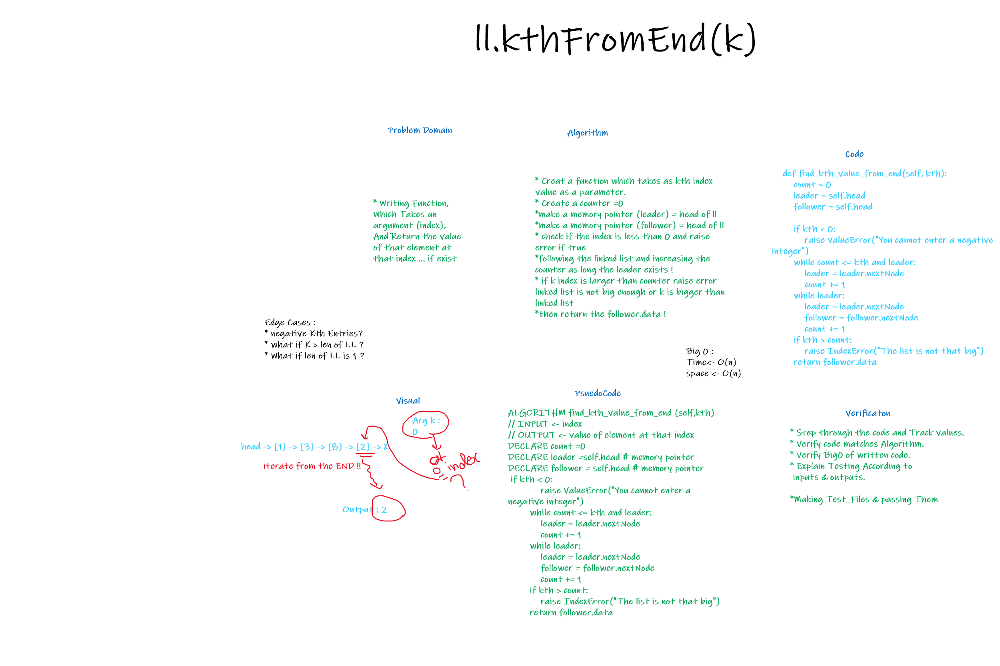

# linked-list-insertions

> [Back to Home](../README.md)

## Question is

> Writing Function, Which Takes an argument (index),And Return the value of that element at that index ... if exist

    append
    arguments: new value
    adds a new node with the given value to the end of the list

    find_kth_value_from_end
    arguments: kth_index
    finds the value of that index

## **Whiteboard Process**

## Approach & Efficiency

-   Create 2 methods & Test files for them:

        def append(self, value):
        if self.head is None:
            self.head = Node(value, None)
            return

        ______________________________________________________

          def find_kth_value_from_end(self, kth):
        count = 0
        leader = self.head
        follower = self.head

        if kth < 0:
            raise ValueError("You cannot enter a negative integer")
        while count <= kth and leader:
            leader = leader.nextNode
            count += 1
        while leader:
            leader = leader.nextNode
            follower = follower.nextNode
            count += 1
        if kth > count:
            raise IndexError("The list is not that big")
        return follower.data

-   also some test files for these Methods \_ All PASSED

> [Back to Home](../README.md)
