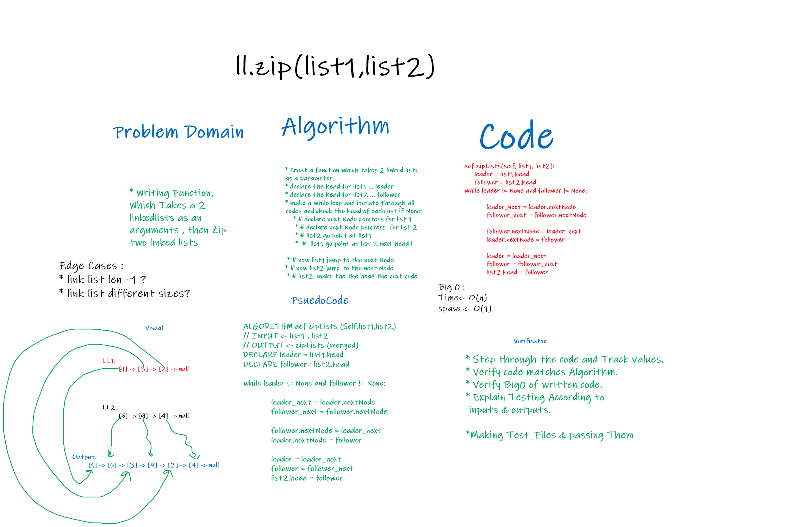

# linked-list-zip

> [Back to Home](../README.md)

## Question is

> Writing Function, Which Takes a 2 linkedlists as an arguments , then Zip two linked lists

    append
    arguments: new value
    adds a new node with the given value to the end of the list

    ZIP_LIST
    arguments: list1,list2
    merge the two ll.lists

## **Whiteboard Process**

## Approach & Efficiency

    """
    Helped from https://www.geeksforgeeks.org/merge-a-linked-list-into-another-linked-list-at-alternate-positions/

        This function takes Two differemt L.Lists as an argument and then zips them together ex, also takes in consideration the difference in lengths between the two linked lists :
        LL1:
        [1] -> [3] -> [2] -> null

        LL2:
        [5] -> [9] -> [4] -> null

        Output:
        [1] -> [5] -> [3] -> [9] -> [2] -> [4] -> null
    """

    * Creat a function which takes 2 linked lists  as a parameter.
    * declare the head for list1 ... leader
    * declare the head for list2 ... follower
    * make a while loop and iterate through all nodes and check the head of each list if None:
        * # declare next Node pointers for list 1
        * # declare next Node pointers  for list 2
        * # list2 go point at list1
        * # list1 go point at list 2 next head !

    * # now list1 jump to the next Node
    * # now list2 jump to the next Node
    * # list2  make the the head the next node

> [Back to Home](../README.md)
