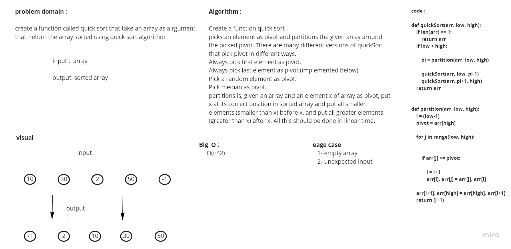

# Data-Structures-and-Algorithms Quick Sort

> [Back to Home](../README.md)

## Problem domain

This challenge asks us to write a function that takes a list of integers as an arguement. The function sorts the array in-place by using a Quick sort algorithm.

## **Whiteboard Process**



## Approach & Efficiency

```md
- iterate through the array and find the pivot point using the partition function to sort the array and use the swap function to swap the pivot with the last element in the array

  > Time Complexity: O(n^2)
  > Space Complexity: O(n)
```

## Solution

```python

def QuickSort(arr, left, right):
    if left < right:
        position = partition(arr, left, right)

        QuickSort(arr, left, position - 1)

        QuickSort(arr, position + 1, right)


def partition(arr, left, right):
    pivot = arr[right]

    low = left - 1
    for i in range(left, right):
        if arr[i] <= pivot:
            low += 1
            # arr[i], arr[low] = arr[low], arr[i]  // Faster method but following pseudo code
            swap(arr, i, low)

    swap(arr, right, low + 1)

    return low + 1


def swap(arr, i, low):
    temp = arr[i]
    arr[i] = arr[low]
    arr[low] = temp

```

## pull requests

[pr `29` - trees-intersection](https://github.com/Ammaro173/data-structures-and-algorithms/pull/29)

> [Back to Home](../README.md)
