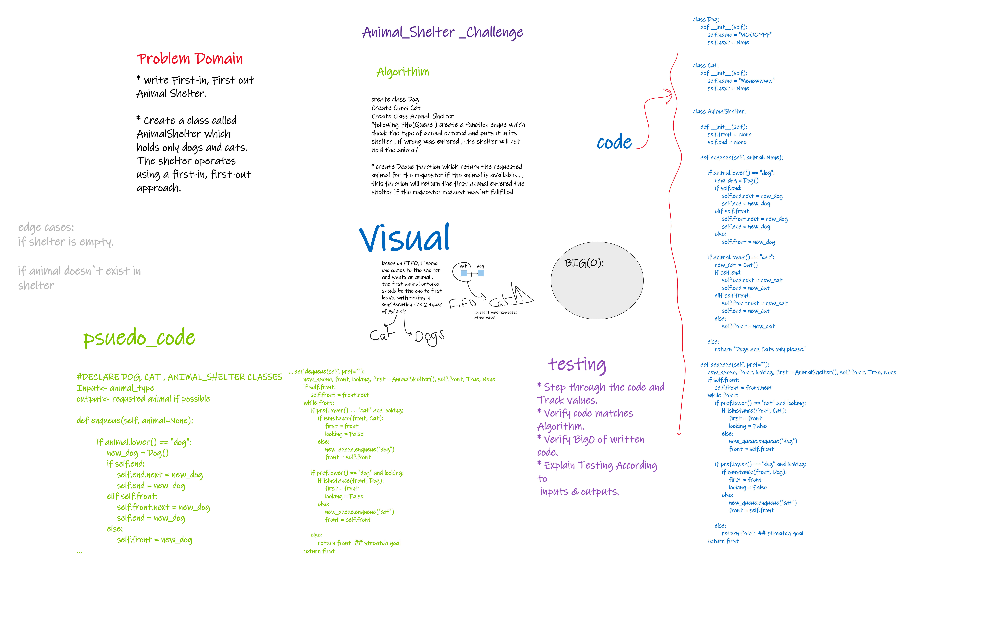

# Animal_Shelter

## Challenge 12

> Implement an Animal Shelter using FIFO(Queue) , Holding Onlyt Cats and Dogs in the shelter, and retuning the oldest animal to the owner if possible.

### Structure and Testing

Utilize the Single-responsibility principle: any methods you write should be clean, reusable, abstract component parts to the whole challenge.

and written Tests.

## whiteboarding

## Approach & Efficiency

-Utilize the Single-responsibility principle + following step by step solution and testing

Big O(n) for time
big 0(n) for space

    *following Fifo(Queue ) create a function enque which check the type of animal entered and puts it in its shelter , if wrong was entered , the shelter will not hold the animal/

    * create Deque Function which return the requested
    animal for the requester if the animal is available... , this function will return the first animal entered the shelter if the requester request was`nt fullfilled

## API

---
