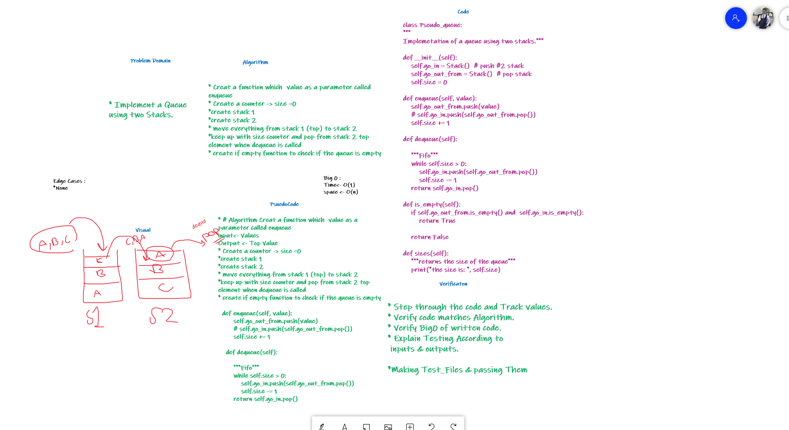

# Stacks and Queues

## Challenge 11

> Implement a Queue using two Stacks.

    Create a new class called pseudo queue.
    Do not use an existing Queue.
    Instead, this PseudoQueue class will implement our standard queue interface (the two methods listed below),
    Internally, utilize 2 Stack instances to create and manage the queue
    Methods:
      enqueue
        Arguments: value
        Inserts value into the PseudoQueue, using a first-in, first-out approach.
      dequeue
        Arguments: none
        Extracts a value from the PseudoQueue, using a first-in, first-out approach.h
    NOTE: The Stack instances have only push, pop, and peek methods. You should use your own Stack implementation. Instantiate these Stack objects in your PseudoQueue constructor.

### Structure and Testing

Utilize the Single-responsibility principle: any methods you write should be clean, reusable, abstract component parts to the whole challenge.

and written Tests.

## whiteboarding

## Approach & Efficiency

-Utilize the Single-responsibility principle +

Big O(1) for time
big 0(n) for space

## API
