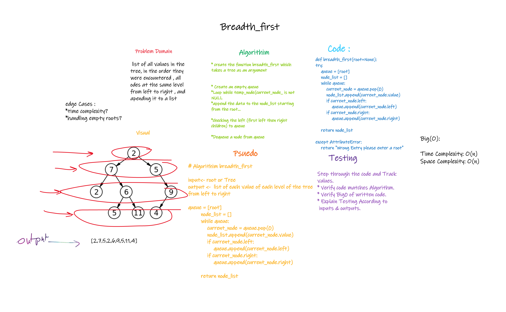

# Trees

## Challenge 17

## breadth_first

### Structure and Testing

Utilize the Single-responsibility principle: any methods you write should be clean, reusable, abstract component parts to the whole challenge.

and written Tests.

## whiteboarding

## Approach & Efficiency

    1 Create an empty queue q

    2. temp_node = root /_start from root_/
    3. Loop while temp_node is not NULL
      a. print temp_node->data.
      b. Enqueue temp_node’s children
      (first left then right children) to q
      c. Dequeue a node from q.

      > Time Complexity: O(n) where n is the number of nodes in the binary tree
      > Space Complexity: O(n) where n is the number of nodes in the binary tree

## API

---
