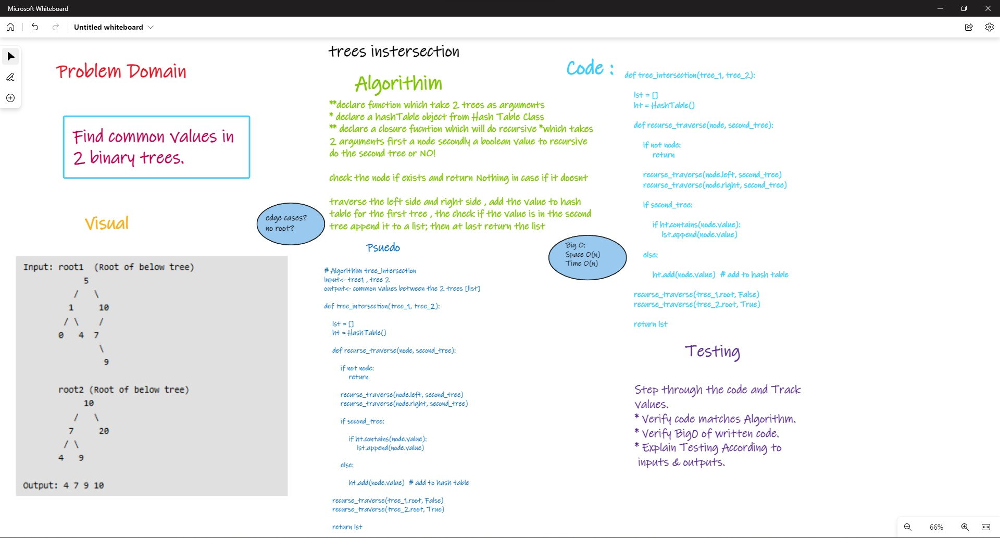

# trees-intersection

## Challenge 32

### Structure and Testing

Utilize the Single-responsibility principle: any methods you write should be clean, reusable, abstract component parts to the whole challenge.

and written Tests.

## whiteboarding



## Approach & Efficiency

```md
- iterate through the string input and check if the word exists in the hashmap after save the word and the count in the hashmap using regex approach

  > Time Complexity: O(n)
  > Space Complexity: O(n) worst case
```

## Solution

```python
def tree_intersection(tree_1, tree_2):

    lst = []
    ht = HashTable()

    def recurse_traverse(node, second_tree):

        if not node:
            return

        recurse_traverse(node.left, second_tree)
        recurse_traverse(node.right, second_tree)

        if second_tree:

            if ht.contains(node.value):
                lst.append(node.value)

        else:

            ht.add(node.value)

    recurse_traverse(tree_1.root, False)
    recurse_traverse(tree_2.root, True)

    return lst
```

## pull requests

[pr `27` - trees-intersection](https://github.com/Ammaro173/data-structures-and-algorithms/pull/27)
[pr `28` - trees-intersection](https://github.com/Ammaro173/data-structures-and-algorithms/pull/28)
