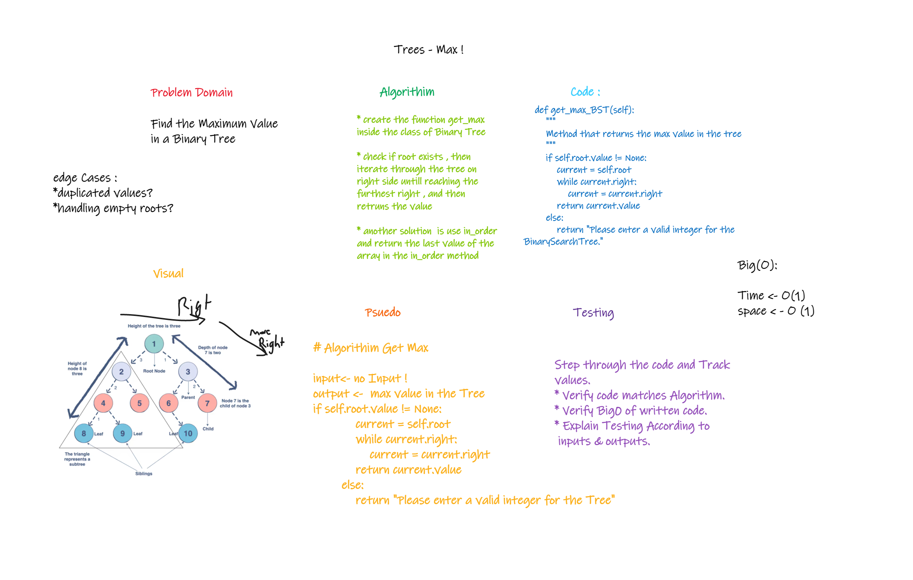

# Tree_Max

## Challenge 16

> get the max of the tree

### Structure and Testing

Utilize the Single-responsibility principle: any methods you write should be clean, reusable, abstract component parts to the whole challenge.

and written Tests.

## whiteboarding

## Approach & Efficiency

    - create the function get_max inside the class of Binary Tree

    - check if root exists , then iterate through the tree on right side untill reaching the furthest right , and then retruns the value

    - another solution is use in_order and return the last value of the array in the in_order method

Big O(1) for time
big 0(1) for space

## API

---
