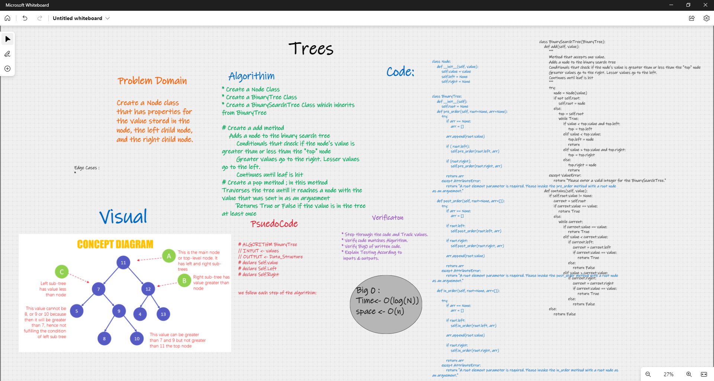

# Validate_Brackets

## Challenge 15

> - Trees_Data_Structure
> - Cretae Binary Search Tree

### Structure and Testing

Utilize the Single-responsibility principle: any methods you write should be clean, reusable, abstract component parts to the whole challenge.

and written Tests.

## whiteboarding

## Approach & Efficiency

    * Create a Node Class
    * Create a BinaryTree Class
    * Create a BinarySearchTree Class which inherits from BinaryTree

    # Create a add method
        Adds a node to the binary search tree
            Conditionals that check if the node's value is greater than or less than the "top" node
            Greater values go to the right. Lesser values go to the left.
            Continues until leaf is hit
    # Create a pop method ; in this method
    Traverses the tree untill it reaches a node with the value that was sent in as an arguement
            Returns True or False if the value is in the tree at least once

Big O(Log(N)) for time
big 0(n) for space

## API

---
